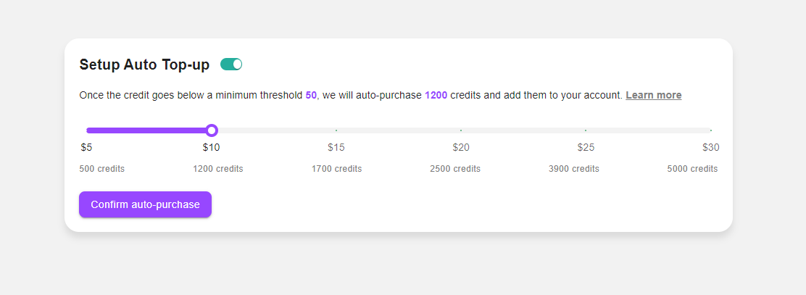

# Auto Top-up Component



This project implements a React component for setting up auto top-up functionality using Material-UI and TypeScript.

## Getting Started

### Prerequisites

- Node.js
- npm

### Installation

1. Clone the repository.
2. Run `npm install` to install dependencies.

### Running the Project

Run `npm start` to start the development server and view the component in your browser.

### Usage

The `AutoTopUp` component can be used within any React application. Import and include it in your JSX.

```typescript
import AutoTopUp from './components/AutoTopUp';

function App() {
  return (
    <div className="App">
      <AutoTopUp />
    </div>
  );
}

export default App;